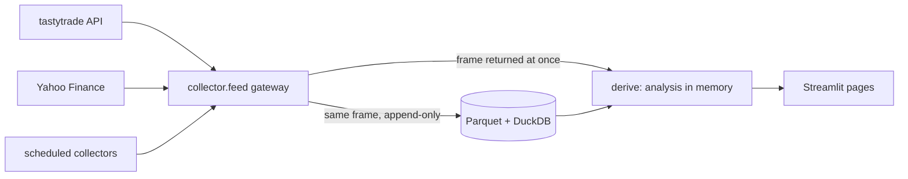

# Alpha Surface

[](https://github.com/corrionhank/alpha-surface/actions/workflows/ci.yml)

Alpha Surface is an options and volatility analytics dashboard. It shows where implied
volatility sits against realized volatility, what the options market has priced for each name,
and which contracts look expensive or cheap against the vol actually delivered. Live data comes
from the tastytrade API, daily history from Yahoo Finance, and every pull is stored in DuckDB over
Parquet for later study and backtests. It informs decisions; it never predicts, signals or trades.

## Features

| Page | What it does |
|---|---|
| Dashboard | Index and vol KPIs, SPY and QQQ charts, implied vs realized vol by name, VIX term curve, fund fundamentals, fear and greed, economic calendar and news |
| Options | Straddle board per expiry; for one contract: IV, Greeks, intrinsic and extrinsic, extrinsic per day, priced vs realized vol, seller yield and APY |
| Screener | Scans many chains for eight setups (stale after a move, realized up and IV asleep, rich premium, cheap convexity, unusual activity, price spikes, open gaps, 0DTE), compares options with the underlying over simulated paths, and sends opt-in alerts |
| Charts | Saved per-user watchlist, candlestick chart with live marks, key stats (ranges, volume, RV21, IVx, IV rank, earnings) |
| Volatility | Implied vol surface by log-moneyness and expiry, and the ATM term structure, solved from chain mids |
| Research | Fundamentals: statements, valuation, earnings history, recent SEC filings with links. Economy: economic calendar, Treasury curve, FRED macro panel when `FRED_API_KEY` is set |
| Docs | The formula sheet and the docs below, rendered in the app |

Tools: option pricer (Black-Scholes price, Greeks, value vs spot) and pot odds (breakeven win rate
against implied and realized probabilities). Both open as dialogs from the Tools menu in the top
bar on every page, and from the selected contract on the Options page, prefilled from it.

## Architecture



Every pull goes through one gateway: the caller gets the data immediately and the same frame is
written to the store, so the history for backtests builds up as a side effect of using the app.
Details in [docs/architecture.md](docs/architecture.md).

## Quickstart

Python 3.11 or later.

```bash
git clone https://github.com/corrionhank/alpha-surface.git
cd alpha-surface
python -m venv .venv && source .venv/bin/activate
make install            # editable install with dev tools and git hooks
cp .env.example .env    # optional: tastytrade credentials for live data
make collect-bars       # seed daily and hourly bars from Yahoo
make run                # http://localhost:8501
```

The site opens on a landing page. Sign-in is a mock: any email and password, or the demo account,
gets you in. Run `make` to list every target.

## Configuration

| Setting | Where | Notes |
|---|---|---|
| tastytrade OAuth | `.env` (`TASTYTRADE_CLIENT_SECRET`, `TASTYTRADE_REFRESH_TOKEN`) | Create a personal OAuth app with the read scope only, then a grant for its refresh token. Without them, bars and quotes come from Yahoo and the chain pages start on sample data. |
| Data directory | `ALPHASURFACE_DATA_DIR`, else `[storage] data_dir` in `config/config.toml`, else `./data` | Parquet files and `market.duckdb` |
| Universe | `config/symbols.toml` | Index ETFs, the VIX family, cross-asset ETFs |
| Saved scans | `config/scans.toml` (from `scans.example.toml`) | Used by `make scan ARGS="--saved <name>"` |
| FRED | `.env` (`FRED_API_KEY`) | Optional; enables the macro panel on Research |
| Alerts, Finnhub | `config/config.toml` (from `config.example.toml`) | Optional and off by default |

`.env`, `config/config.toml` and `data/` are gitignored.

## Development

```bash
make check        # lint, type check, tests
make cov          # tests with the coverage floor
make format       # ruff fixes and formatting
pre-commit run --all-files
```

CI runs lint, a type check, the tests on Python 3.11 and 3.13 with a coverage floor, a
dependency audit and a secret scan on every push and pull request. See
[CONTRIBUTING.md](CONTRIBUTING.md).

## Deployment

The image `ghcr.io/corrionhank/alpha-surface` is published from main.

```bash
docker compose up -d
```

Scheduled collection (launchd on macOS, systemd on Linux, or Docker) is in
[deploy/README.md](deploy/README.md).

## Project structure

```
src/alphasurface/
  config.py         settings and secrets (.env, config/config.toml)
  collector/        providers, the feed gateway, tastytrade session and streamer, CLIs
  storage/          Parquet writers, DuckDB views and readers
  derive/           pricing, implied vol, metrics, scanner rules, simulation, sentiment
  present/          Streamlit pages, theme, charts
tests/              pytest suite, no network
studies/            standalone research (protective puts)
config/             universe and example configs
deploy/             launchd and systemd schedules
docs/               architecture, schema, formulas, dashboard, scanner, decisions
```

## Data and limits

- tastytrade: free real-time data for funded accounts; unfunded accounts get delayed quotes. The
  app keeps one session and one DXLink streamer per process, backs off on 429 and 5xx, and never
  retries a failed sign-in (repeated failures can block the IP for hours). DXLink allows 5
  sessions and 25,000 subscriptions.
- Yahoo Finance: unofficial, rate limited, about 15 minutes delayed; hourly bars go back about
  730 days. Bars are topped up incrementally, never bulk re-pulled.

## Disclaimer

For research and education. Nothing here is investment advice. The tastytrade connection is
read-only by design: no code path places, cancels or changes an order.

## Docs

| File | Contents |
|---|---|
| [docs/architecture.md](docs/architecture.md) | Layers, data flow, storage, concurrency, page layout, principles |
| [docs/schema.md](docs/schema.md) | Every stored table and its columns |
| [docs/formulas.md](docs/formulas.md) | Formula reference for every computed metric |
| [docs/dashboard.md](docs/dashboard.md) | Dashboard page: data, KPIs, fear and greed lens |
| [docs/scanner.md](docs/scanner.md) | Screener rules, thresholds, CLI and alerts |
| [docs/decisions.md](docs/decisions.md) | Architecture decisions and their dates |
| [CHANGELOG.md](CHANGELOG.md) | Release notes |
| [TODO.md](TODO.md) | Open work, highest value first |

License: not yet chosen.
